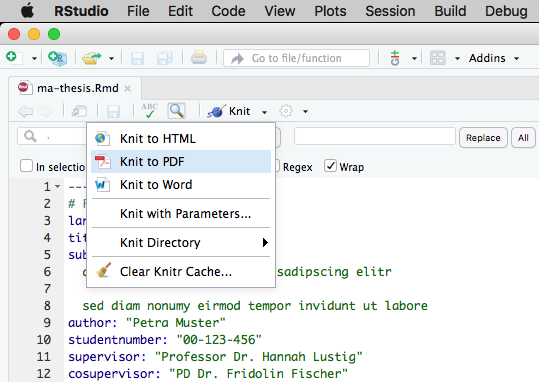

# University of Zurich Master Thesis Template

University of Zurich Master Thesis Template (Universität Zürich Masterarbeit Vorlage) in RMarkdown and Latex in accordance to [Bestimmungen zur Masterarbeit an der Philosophischen Fakultät der Universtät Zürich (UZH)](http://www.phil.uzh.ch/de/studium/studentservices/abschluss/master.html#4).

[](https://github.com/maehr/uzh-ma-thesis/issues)
[](https://github.com/maehr/uzh-ma-thesis/network)
[](https://github.com/maehr/uzh-ma-thesis/stargazers)
[](https://github.com/maehr/uzh-ma-thesis/blob/master/LICENSE.md)

## Getting Started

These instructions will get you a copy of the project up and running on your local machine.

### Prerequisites

Install all prerequisites

- [R](https://www.r-project.org/)
- [RStudio](https://www.rstudio.com/products/rstudio/download/) (or [knitr](https://yihui.name/knitr/) and all its dependencies)
- [LaTeX](https://www.latex-project.org/get/#tex-distributions)

or use this [Homebrew](https://brew.sh/) command `brew install r && brew cask install rstudio mactex` on OSX.

### Use

#### Use with RStudio



1. Open `ma-thesis.Rproj` with [RStudio](https://www.rstudio.com/products/rstudio/download/)
2. Change `ma-thesis.Rmd` to your liking.
3. Render a PDF with a click on `Knit to PDF`

#### Use with R command line

```r
install.packages('knitr', dependencies = TRUE)
library(knitr)
knit('ma-thesis.Rmd')
```

## Contributing

Please read [CONTRIBUTING.md](https://github.com/maehr/uzh-ma-thesis/blob/master/CCONTRIBUTING.md) for details on our code of conduct, and the process for submitting pull requests to us.

## Versioning

We use [SemVer](http://semver.org/) for versioning. For the versions available, see the [tags on this repository](https://github.com/maehr/uzh-ma-thesis/tags).

## Authors

* **Moritz Mähr** - *Initial work* - [maehr](https://github.com/maehr)

See also the list of [contributors](https://github.com/maehr/uzh-ma-thesis/graphs/contributors) who participated in this project.

## License

This project is licensed under the MIT License - see the [LICENSE.md](LICENSE.md) file for details

## Acknowledgments

* [Pandoc](https://pandoc.org/)
* [Markdown](https://daringfireball.net/projects/markdown/)
* [RMarkdown](https://rmarkdown.rstudio.com/)
* [Bookdown](https://bookdown.org/)
* [CSL](https://citationstyles.org/)
* [LaTeX](https://www.latex-project.org/)
